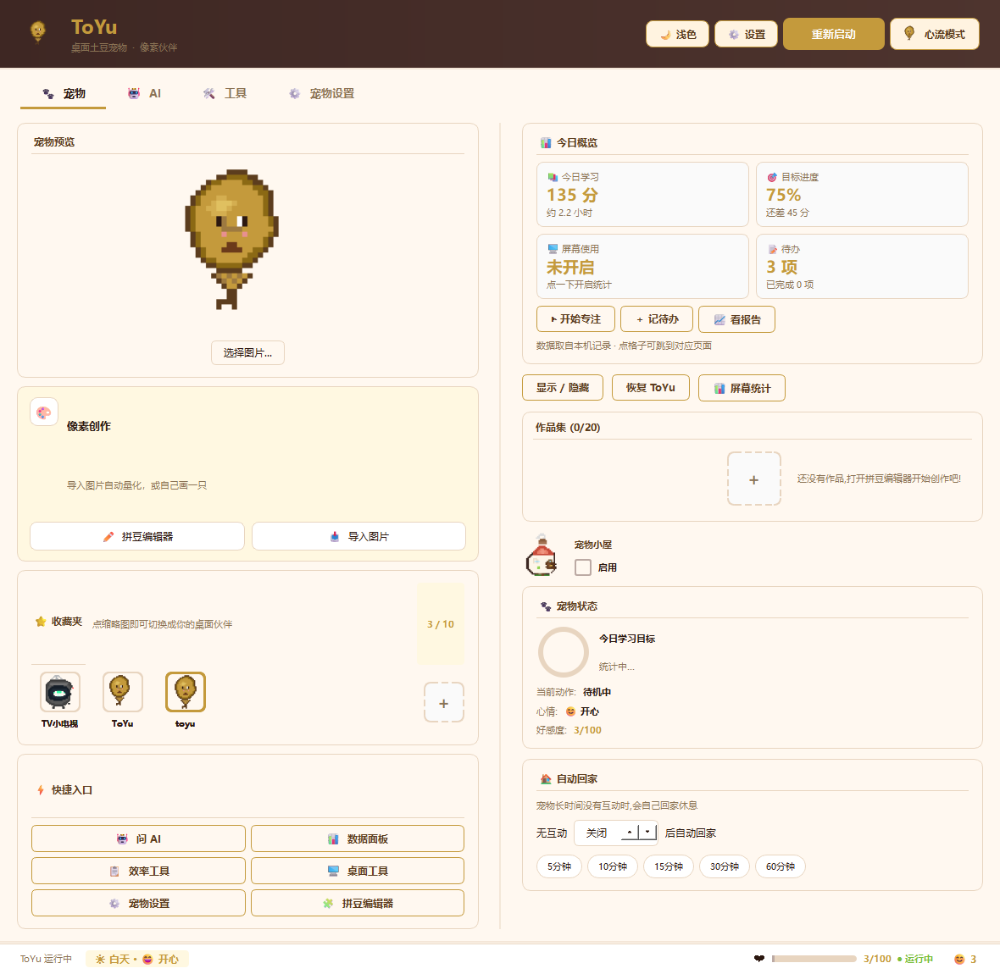
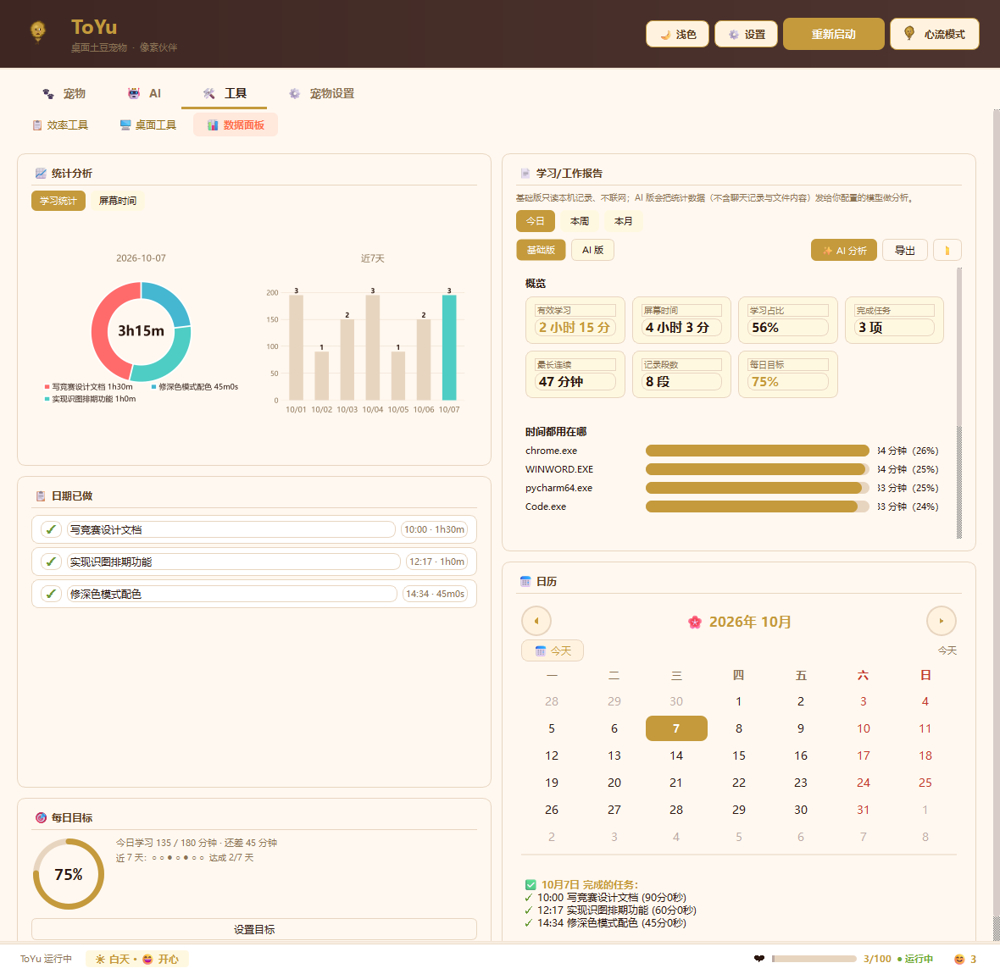
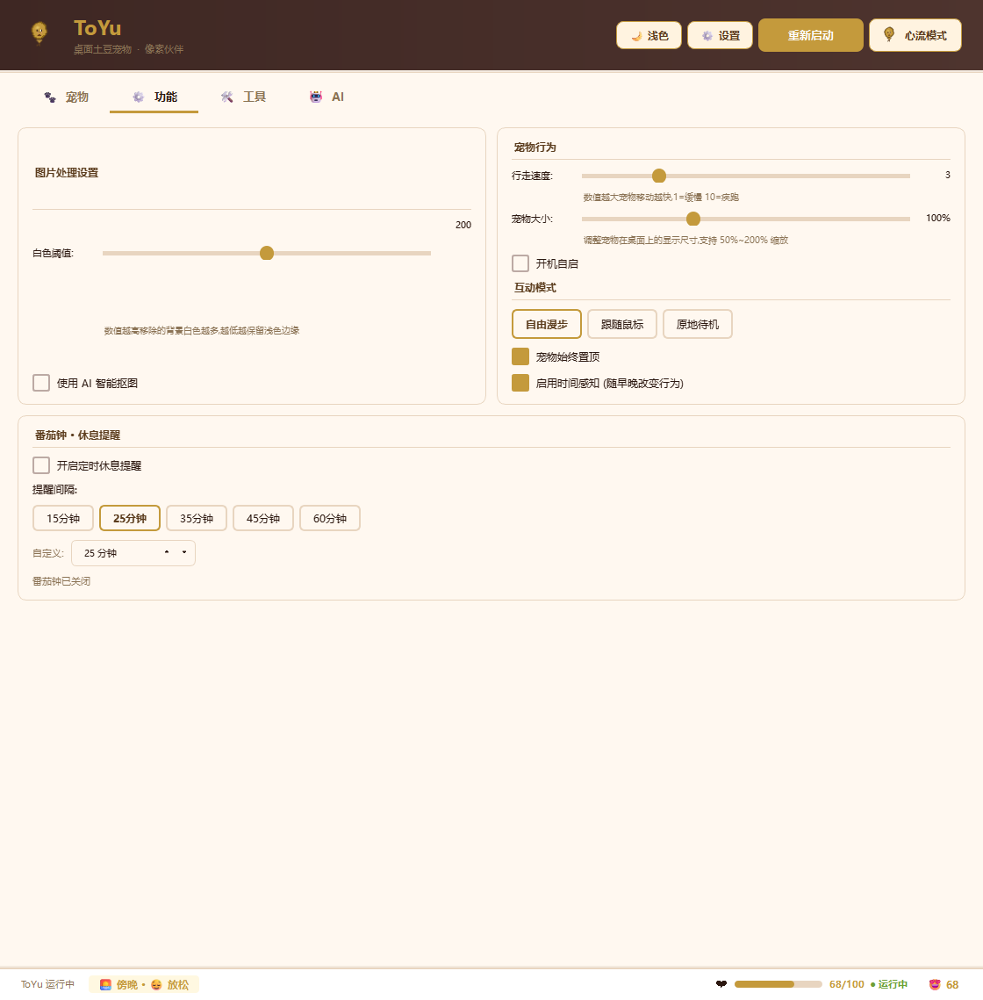
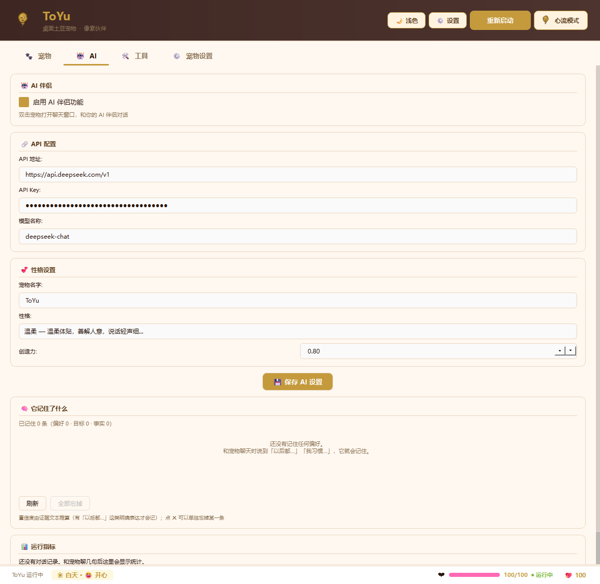
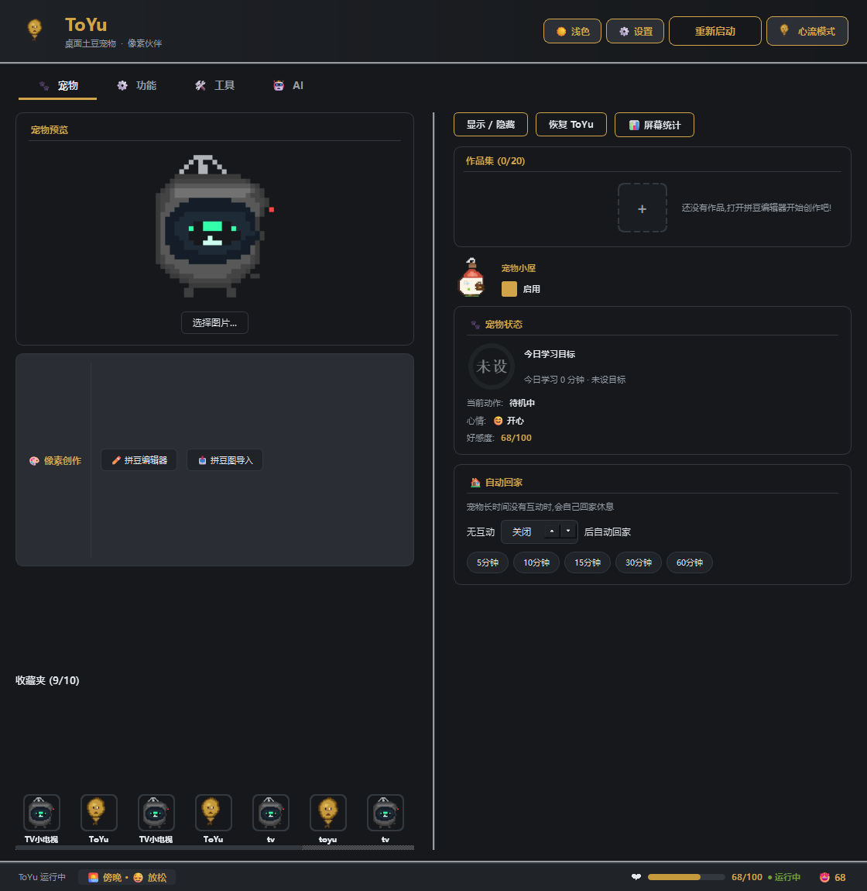
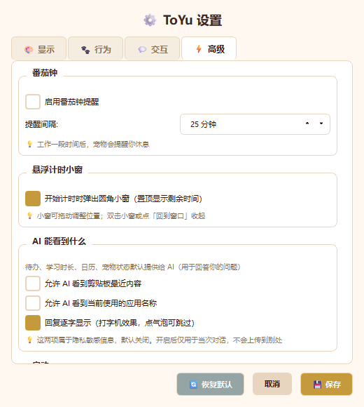

<div align="center">
  
</div>

<div align="center">

# ToYu

**会盯进度的桌面学习智能体**

它从屏幕时间里**实测**你的有效学习时长，盯着每日目标，到点提醒、欠账补上 ——
你说一句「帮我安排下周的复习计划」，它真的会去查记录、写待办、设目标。

<sub>外壳是一只住在桌面上的像素宠物，内核是一套完整的 AI 智能体运行时：<br>
本机 12 个工具 · 最多自主执行 5 轮 · 20 个受控记忆槽位</sub>

[](https://github.com/sunhao33/ToYu-Desktop-Pet/releases)
[](#-快速开始)
[](#-快速开始)
[](https://pypi.org/project/PyQt6/)
[](#-开发与测试)
[](LICENSE)

[功能特性](#-功能全览) · [架构设计](docs/ARCHITECTURE.md) · [开发指南](docs/DEVELOPMENT.md) · [下载](#-快速开始) · [在线体验](toyu-web/)

</div>

---

## 📸 界面

<table>
<tr>
<td width="50%">

**宠物页** — 今日概览（学习 / 目标 / 屏幕 / 待办）+ 快捷入口 + 收藏夹



</td>
<td width="50%">

**数据面板** — 学习报告 + 时段/应用图表 + 日历 + 每日目标环



</td>
</tr>
<tr>
<td width="50%">

**宠物设置** — 图片处理、宠物行为、番茄钟休息提醒



</td>
<td width="50%">

**AI 助手** — 对话、长期记忆、12 个本机工具（能真改设置、能切页）



</td>
</tr>
</table>

<div align="center">

**深色模式** — 每项配色都按 WCAG AA 实测（正文对比度 12.7:1）



<br><br>

**设置** — 高级页内容较多，改用滚动区承载（原先溢出 200px 会挤在一起）



</div>

---

## 🤖 这是智能体，不只是桌宠

多数桌面宠物止步于「会动、会卖萌」。ToYu 把宠物当作**交互外壳**，
内核是一套完整的智能体运行时 —— 宠物解决了「低成本自然交互入口」
这件事，这是纯聊天窗口给不了的。

### 一次真实的执行过程

> **你**：帮我看看这周学习情况，然后安排下周的复习计划
>
> **ToYu**：我先查一下你这周的学习记录。
> `🔧 get_study_report`
> → 本周有效学习 8.5 小时，集中在编辑器与浏览器；周三、周五几乎空白
>
> **ToYu**：发现两个空白日。我再看看你的待办里有没有欠账。
> `🔧 list_todos`
> → 3 项未完成：「复习机器学习第 3 章」「写竞赛设计文档」「整理实验数据」
>
> **ToYu**：明白了。我把复习计划拆成 4 项写进待办，并给周三、周五各设 1 小时目标。
> `🔧 add_todo` `🔧 set_daily_goal`
> → 已添加 4 项待办（高优先级 2 项）· 目标已设为 60 分钟
>
> **ToYu**：安排好了！这周的空档主要出在周中，我把最难的两项放在了周三和周五上午。
> <sub>共 3 轮工具调用 · 全程留痕可追溯</sub>

**不是一次性生成，而是像人一样边做边看。**

### 六项核心能力

| 能力 | 实现要点 |
|---|---|
| **多步工具调用** | **12 个**本机工具（待办 / 专注 / 统计 / 日历 / 报告 / 宠物行为 / **改设置** / **切页面**）；最多 **5 轮**循环，每轮观察真实结果再决策 |
| **受控长期记忆** | **20 个槽位**（15 偏好 / 3 目标 / 2 事实）。不信模型自报的置信度 —— 从证据文本重新估算 |
| **上下文注入** | 6 个优先级块的桌面状态，token 预算内自动裁剪 |
| **线程安全执行** | Agent 循环在子线程，需要碰 Qt 的工具排队回主线程 |
| **三条刹车** | 5 轮 / 单轮 4 工具 / 单工具 20s / 整轮 90s；连续失败 2 次即停 |
| **三级降级** | 记忆、上下文、报告分析各自独立降级，任何一层坏了主流程照常 |

### 三条工程纪律

**① 不该用模型的地方就不用**
统计、阈值、规则判定全部由代码完成；模型只做「非结构化文本 → 结构化数据」
和「语言组织」。不配 API Key 时全部本机功能照常可用。

**② 不信模型说的话**
记忆置信度由代码从证据重算（显性信号 ≥0.90 / 弱信号 ≥0.70 / 否则 ≤0.60）；
报告里的数字只从已有接口读取，**禁止模型自己造数**；
工具参数经 JSON Schema 强校验，不合法就回灌让它重试。

**③ 出问题不能拖垮主流程**
任何一层失败只影响该功能本身；入口还有崩溃守卫 ——
未捕获异常写日志并继续运行，程序不退出。

---

## ✨ 功能全览

<table>
<tr><td width="50%" valign="top">

### 📚 学习与工作

- **学习/工作报告** — 日/周/月汇总有效学习时长、应用分布、时段规律、完成任务数；基础版（纯本机）与 AI 版（深度分析），可导出 Markdown
- **心流模式** — 番茄轮次、休息机制、今日专注时间轴；计划项独立计时
- **每日目标** — 进度环 + 历史坚持曲线
- **屏幕时间统计** — 应用排行、时段分布，跨零点正确切分
- **待办管理** — 优先级、番茄计时、完成记录

</td><td width="50%" valign="top">

### 🎨 桌宠与创作

- **物理引擎** — 重力、落地、屏幕边缘碰撞、60fps 动画
- **好感度系统** — 8 种互动，每日上限与里程碑
- **环境感知** — 夜晚变暗变慢、下雨撑伞、高温吃冰淇淋
- **配件与特效** — 7 种配件、5 种粒子特效
- **拼豆编辑器** — 51 色调色板手绘；导入图片自动抠图 + 颜色量化
- **像素小房子** — 宠物可进出

</td></tr>
</table>

---

## 🚀 快速开始

### 方式一：下载发布包（推荐）

1. 到 [**Releases**](https://github.com/sunhao33/ToYu-Desktop-Pet/releases) 下载最新的 `ToYu_v*.zip`
2. 解压到任意目录
3. 双击 `ToYu\ToYu.exe` 启动（绿色免安装，删掉文件夹即卸载）

### 方式二：从源码运行

```bash
git clone https://github.com/sunhao33/ToYu-Desktop-Pet.git
cd ToYu-Desktop-Pet/desktop-pet
pip install -r requirements.txt
python main.py
```

**环境要求**：Windows 10/11 64 位 · Python 3.10+（开发环境为 3.14）

> **启用 AI 功能**：启动后「设置 → AI」填入你自己的 API Key
> （兼容 DeepSeek / OpenAI 等 OpenAI 格式接口）。
> **不填也能用** —— 计时、报告、目标、待办、拼豆全部可用，数据只存在本机。

---

## 🏗 架构

```
┌─────────────────────────────────────────────────────────────┐
│  界面层  ui/                                                  │
│    main_window.py      主窗口（宠物 / 功能 / 工具 / AI 四页）  │
│    flow_window.py      心流模式独立窗口                        │
│    widgets/            进度环 · 报告渲染 · 专注时间轴           │
└───────────────────────────┬─────────────────────────────────┘
                            │ Qt 信号 / 主线程
┌───────────────────────────▼─────────────────────────────────┐
│  智能体运行时  pet_engine/agent/                               │
│    loop.py            多轮主循环 + 三条刹车                    │
│    runtime.py         线程安全工具执行桥（子线程 → 主线程队列）  │
│    tools.py           工具注册表（12 个本机工具）               │
│    protocol.py        工具调用契约（JSON Schema 强校验）        │
│    context.py         上下文注入（6 优先级块 + token 预算）      │
│    memory_store.py    长期记忆（20 受控槽位）                   │
│    memory_extract.py  记忆抽取 + 置信度从证据重估               │
└───────────────────────────┬─────────────────────────────────┘
                            │
┌───────────────────────────▼─────────────────────────────────┐
│  业务与宠物内核  pet_engine/                                   │
│    pet_window.py       渲染 + 主循环      pet_physics.py  物理  │
│    pet_state_machine.py 状态机            pet_ai.py      传输层 │
│    report.py           学习工作报告        goal.py       每日目标│
│    focus_log.py        专注记录            pet_companion.py 心情 │
└─────────────────────────────────────────────────────────────┘
```

**线程模型**：Agent 主循环跑在**子线程**（否则一调工具就与主线程死锁）；
需要操作 Qt 的工具通过 `runtime.py` 排队回主线程执行。
跨线程通知一律用 `pyqtSignal` —— 实测 `QTimer.singleShot` 从子线程
投递回主线程会**静默失效**。

📖 详细设计见 [**docs/ARCHITECTURE.md**](docs/ARCHITECTURE.md)

---

## 🧪 开发与测试

```bash
# 全量回归（27 个测试文件，约 170 秒）
python dev/_test_all.py

# 打包发布
python -m PyInstaller ToYuDir.spec --noconfirm --distpath dist_dir2 --workpath build_dir2
python dev/_package.py
```

**测试覆盖**：宠物物理与状态机 · 智能体工具调用与端到端集成 · 记忆抽取与契约校验 ·
上下文注入 · 学习报告与图表 · 每日目标 · 心流模式 · 悬浮计时窗 · 窗口缩放 ·
数据落盘原子性 · 崩溃守卫。

📖 开发约定与调试技巧见 [**docs/DEVELOPMENT.md**](docs/DEVELOPMENT.md)

---

## 📂 项目结构

```
ToYu-Desktop-Pet/
├── desktop-pet/              应用本体
│   ├── main.py               入口（含崩溃守卫）
│   ├── pet_engine/           宠物内核 + 智能体运行时
│   │   └── agent/            智能体：循环 / 工具 / 记忆 / 上下文
│   ├── ui/                   界面
│   ├── image_processor/      抠图与颜色量化
│   ├── resources/            素材
│   └── dev/                  开发工具（测试 27 套 · 探针 · 打包脚本）
├── toyu-web/                 宣传站（静态，零依赖）
└── docs/                     README 配图与设计文档
```

---

## ❓ 设计决策

<details>
<summary><b>为什么桌面宠物要做智能体？</b></summary>

桌宠天生是「陪伴」场景，而陪伴最缺的是**记得住、能办事**。
把智能体内核塞进宠物外壳后，用户不用切窗口、不用打开新软件 ——
直接跟桌面上那只说话，它就能查你的学习情况、加待办、生成报告。
宠物提供了低成本的自然交互入口，这是纯聊天窗口给不了的。
</details>

<details>
<summary><b>为什么不用向量数据库做记忆？</b></summary>

只有 20 个受控槽位，用字符 2-gram + 时间衰减的相关度就够，
且**可解释、零依赖、可预测**（MIN_RELEVANCE=0.08，MIN_SCORE=0.18）。
引入向量库会让安装包暴涨上百 MB，收益却不成正比。
槽位受限反而避免了「记忆无限膨胀变成噪音」。
</details>

<details>
<summary><b>怎么防止模型乱来？</b></summary>

- **参数强校验**：工具参数走 JSON Schema，类型/长度/取值范围都查，失败把原因回灌让模型重试
- **三条刹车**：最多 5 轮、单轮最多 4 个工具、单工具 20 秒、整轮 90 秒；连续失败 2 次即停
- **提示注入防护**：窗口标题、剪贴板等外部文本进入上下文前做标记，不当作指令
- **置信度重估**：显性信号 ≥0.90，弱信号 ≥0.70，否则压到 0.60 以下并主动确认
</details>

<details>
<summary><b>崩溃了怎么办？</b></summary>

`main.py` 装了崩溃守卫：未捕获异常写进 `%APPDATA%/ToYu/errors.log`，
程序**继续运行**不退出，并在气泡里提示一句。日志超 512KB 自动轮转。
（这个机制本身也有测试覆盖 —— 有专门的假异常注入用例。）
</details>

<details>
<summary><b>数据存在哪里？会上传吗？</b></summary>

全部存在你本机的用户目录：

| 路径 | 内容 |
|---|---|
| `%APPDATA%\ToYu\` | 设置、AI 配置、记忆、报告导出 |
| `~\.desktop_pet\` | 待办、任务历史、屏幕会话、图片素材 |

**不上传**。只有你主动使用 AI 功能时，相关文本才会发给你自己配置的模型服务。
</details>

---

## 🤝 参与贡献

欢迎提 Issue 与 PR。提交前请：

1. 跑通全量回归：`python dev/_test_all.py`
2. 保持零新增依赖（当前依赖见 `requirements.txt`）
3. 新增功能请附对应测试（放在 `dev/`，并在 `_test_all.py` 注册）

---

## 📄 AI 使用披露

本作品在开发过程中**使用 AI 辅助编写代码**。运行时 AI 能力与开发时 AI 辅助是两件事：

- **运行时**：需用户自行配置 API Key 才启用；不配置时全部本机功能正常
- **数据流向**：计时、屏幕统计、待办、记忆全部存在本机；仅在你主动使用 AI 功能时，
  相关文本才会发给你自己配置的模型服务
- **人工负责**：口径设计、阈值取舍、结果复核由人完成

## 🧩 第三方组件

PyQt6 · matplotlib · Pillow · NumPy · psutil · pywin32

## 📜 许可证

见 [LICENSE](LICENSE)
